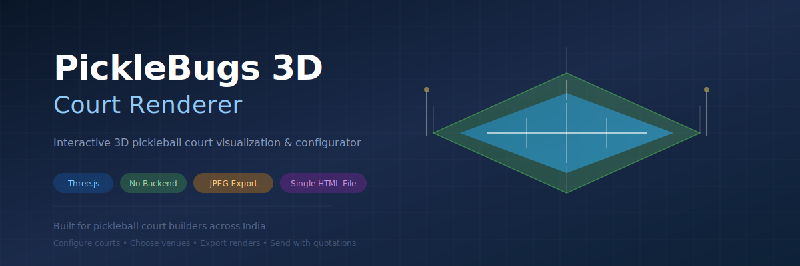
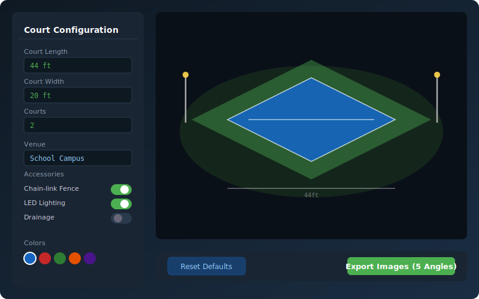
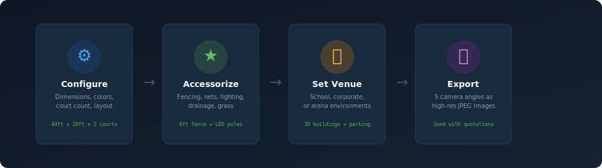

<p align="center">
  
</p>

<p align="center">
  <strong>A browser-based 3D pickleball court configurator and renderer.</strong><br/>
  Built for <a href="https://picklebugs.in">PickleBugs</a> — pickleball court builders across India.
</p>

<p align="center">
  
  
  
  
  
</p>

---

## What is this?

PickleBugs builds professional pickleball courts for schools, corporations, and arenas across India. Before construction begins, clients want to **see what their court will look like** — dimensions, colors, fencing, lighting, the whole setup.

This tool lets anyone configure a court in real-time and export photorealistic 3D renders to include alongside project quotations. No installs, no accounts, no backend — just open the page and start building.

<p align="center">
  
</p>

---

## Features

<p align="center">
  
</p>

### Court Configuration
- **Dimensions** — Set court length, width, and buffer/run-off zones in feet
- **Multi-court layouts** — 1–6 courts in side-by-side, inline, or grid arrangements
- **Color palette** — Pick from 12 court surface colors and 10 buffer zone colors

### Accessories & Infrastructure
- **Chain-link fencing** — Toggle on/off with 4ft or 8ft height options
- **LED flood lighting** — 20ft poles with configurable placement (cornered or centered)
- **Regulation nets** — Standard height pickleball nets with posts
- **Water drainage** — Channel drain system along court sides
- **Surrounding grass** — Landscaped ground around the court area

### Venue Environments
- **School Campus** — 3D school building with trees and pathways
- **Corporate Park** — Office building with glass facade and parking
- **Arena / Rental Facility** — Booking office, spectator area, and parking lot

### Measurement & Export
- **Dual scale system** — Inner scale for court dimensions, outer scale for total area including run-off
- **5-angle JPEG export** — Perspective, top-down, front, side, and close-up renders
- **Specification summary** — Auto-generated text summary of all selected options

---

## Quick Start

**Option 1: Just open it**
```
Download index.html → Open in any modern browser
```

**Option 2: Deploy to Netlify**
1. Fork this repo
2. Connect to [Netlify](https://netlify.com)
3. Deploy — that's it, it's a single HTML file

**Option 3: Embed on your website**
```html
<iframe src="path/to/index.html" width="100%" height="800" frameborder="0"></iframe>
```

---

## Tech Stack

| Layer | Technology |
|-------|-----------|
| 3D Engine | [Three.js r128](https://threejs.org/) via CDN |
| Rendering | WebGL with shadow maps, PBR materials |
| UI | Vanilla HTML/CSS/JS — no frameworks, no build step |
| Export | Canvas `toDataURL()` → JPEG at 5 camera angles |
| Assets | PickleBugs logo embedded as base64 (no CORS issues) |
| Hosting | Any static host (Netlify, Vercel, GitHub Pages, S3) |

The entire application is a **single self-contained HTML file** (~150KB). No dependencies to install, no API keys, no server required. It loads Three.js from a CDN and everything else is inline.

---

## Architecture

```
index.html
├── Inline CSS          — Dark sidebar UI, responsive layout
├── Inline JavaScript
│   ├── Scene Setup     — Camera, renderer, lights, orbit controls
│   ├── Court Builder   — Procedural geometry for courts, nets, fences, poles
│   ├── Venue Builder   — 3D environment generation (school/corporate/arena)
│   ├── Scale System    — Architectural dimension lines with tick marks
│   ├── Export Engine   — Multi-angle JPEG capture
│   └── UI Controller   — Sidebar ↔ scene sync
└── Base64 Assets       — Embedded logo PNG
```

---

## Customization

The code is structured for easy modification:

**Add a new court color:**
Find the `.color-option` buttons in the HTML and add a new one with your hex code.

**Change default dimensions:**
Edit the `resetToDefaults()` function to set your preferred starting values.

**Add a new venue type:**
Create a `buildYourEnvironment()` function following the pattern of `buildSchoolEnvironment()`, then add it to the venue dropdown and the switch statement in `updateScene()`.

**Adjust lighting:**
The scene uses a `DirectionalLight` + `AmbientLight` + `HemisphereLight` combination. Tweak intensities in the scene setup section.

---

## Who's this for?

- **Pickleball court builders** who want to show clients a visual before construction
- **Sports facility planners** exploring court layouts and configurations
- **Three.js developers** looking for a real-world single-file WebGL application example
- **Anyone** who wants to see what a pickleball court looks like in 3D

---

## Contributing

Contributions are welcome! Some ideas for improvements:

- [ ] Additional venue types (residential backyard, community center)
- [ ] Surface texture options (concrete, acrylic, cushioned)
- [ ] Spectator seating configurations
- [ ] PDF quotation generation with pricing
- [ ] Mobile-optimized touch controls
- [ ] Night mode with active lighting simulation

---

<p align="center">
  Built with care by <a href="https://picklebugs.in">PickleBugs</a><br/>
  <sub>Pickleball court construction across India</sub>
</p>
